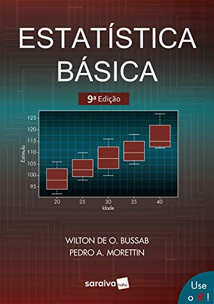

# Estudos_LivroEstatisticaBasica
Guia de estudos do livro Estatística Básica (Morettin, Pedro A. - 9ª Edição), material que estou utilizando como apoio teórico a <i>Formação Estatística com Python (Alura)</i> e ao curso <i>Estatística para Ciência de Dados e Machine Learning (IA Expert Academy - Udemy)</i>.

